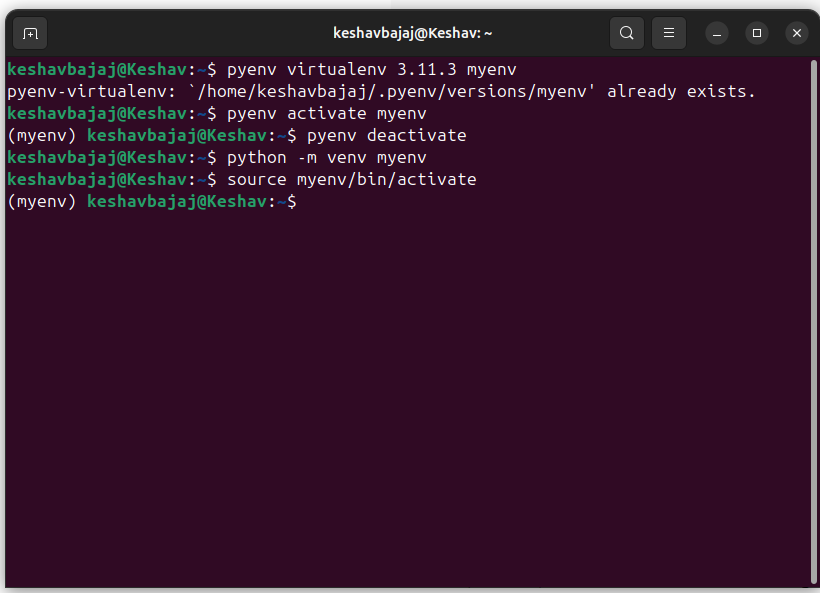
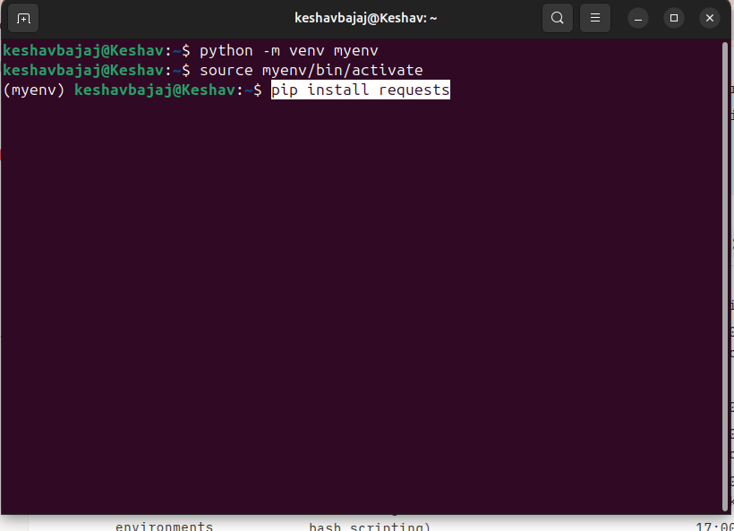
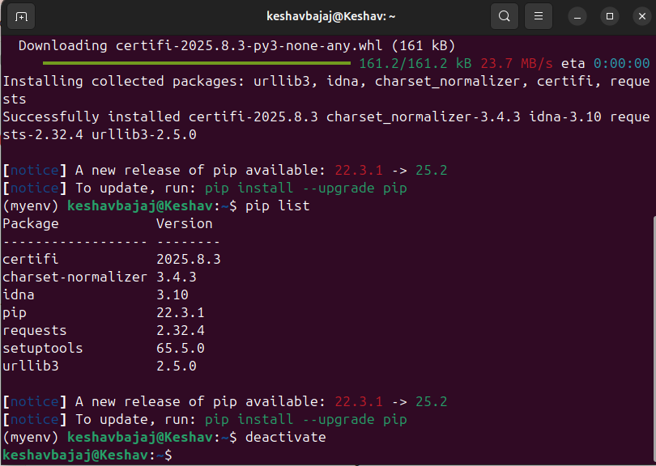

# Python Virtual Environments in VS Code (Linux)

> Goal: Create/activate a project-scoped Python environment, then point **VS Code** to it.

---

## 1) Method A — `pyenv` + `pyenv-virtualenv`

Install the plugin if you don’t have it:

```bash
# Using Homebrew on Linux or manual clone — see plugin README
# (Typical manual install)
git clone https://github.com/pyenv/pyenv-virtualenv.git \
  "$(pyenv root)/plugins/pyenv-virtualenv"
exec "$SHELL"
```

Create & activate:

```bash
pyenv install 3.11.3         # or a newer 3.11.x your course uses
pyenv virtualenv 3.11.3 myenv
pyenv activate myenv
```

<p align="center">
  
</p>

Deactivate & link to a project folder:

```bash
pyenv deactivate
cd /path/to/your/project
pyenv local myenv       # writes .python-version
```

> `pyenv virtualenv`/`pyenv activate` are provided by **pyenv-virtualenv**. ([GitHub][1])

---

## 2) Method B — Python’s built-in `venv`

From your project folder:

```bash
python -m venv .venv
source .venv/bin/activate
# ... work here ...
deactivate
```

<p align="center">
  
</p>

> `venv` is the standard library tool for virtual environments. ([Python documentation][2])

---

## 3) Wire it up in **VS Code**

1. Open the project in VS Code.
2. **Select interpreter**: **Command Palette → “Python: Select Interpreter”** → pick your env (e.g., `.venv` or `myenv`). ([Visual Studio Code][3])
3. (Optional) **Create Environment** via VS Code: **Python: Create Environment** → choose **Venv**. ([Visual Studio Code][4])
4. **Auto-activate in terminal**: ensured by the Python extension (`terminal.activateEnvironment=true`). New terminals will auto-run the correct `activate` script. ([Visual Studio Code][5])

<p align="center">
  
</p>

List packages:

```bash
pip list
```

<p align="center">
  
</p>

---

## References

* VS Code — **Environments / Select Interpreter / Create Environment**. ([Visual Studio Code][3])
* **pyenv-virtualenv** plugin. ([GitHub][1])
* Python docs — **`venv`**. ([Python documentation][2])

---

### Notes

* Using the folder name **`.venv`** makes VS Code detect it automatically and prefer it for that workspace. ([Visual Studio Code][4])
* Keep per-project envs small and reproducible (e.g., `pip freeze > requirements.txt`).

[1]: https://github.com/pyenv/pyenv-virtualenv "a pyenv plugin to manage virtualenv (a.k.a. python- ..."
[2]: https://docs.python.org/3/library/venv.html "venv — Creation of virtual environments"
[3]: https://code.visualstudio.com/docs/python/environments "Python environments in VS Code"
[4]: https://code.visualstudio.com/docs/python/python-tutorial "Getting Started with Python in VS Code"
[5]: https://code.visualstudio.com/docs/python/settings-reference "Python settings reference"
[6]: https://pyenv-win.github.io/pyenv-win/ "pyenv for Windows - GitHub Pages"
[7]: https://github.com/pyenv-win/pyenv-win-venv "A CLI to manage virtual envs with pyenv-win"
